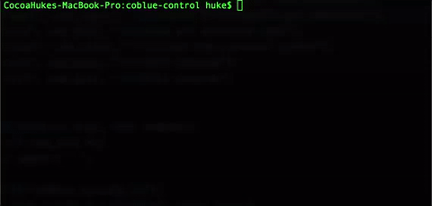

# coBlue
Use Bluetooth Low Energy for remote commands, file transfer, Based on bluez Bluetooth protocol stack

[](https://twitter.com/cocoahuke) [](https://travis-ci.org/cocoahuke/coBlue) [](https://github.com/cocoahuke/coBlue/blob/master/LICENSE) []() [](https://www.paypal.com/cgi-bin/webscr?cmd=_s-xclick&hosted_button_id=EQDXSYW8Z23UY)

Bluetooth Low Energy compared to other forms of wireless connection such as wifi or Bluetooth have more uncomplicated, lower energy consumption. Image your iPhone wirelessly connect to a tiny computer such as raspberry pi etc, and use the powerful tool on Linux

Of course, this can not replace terminal in wifi or usb, but you can do for short thing hiddenly

This project can be installed quickly, run automatically when device boot up. Communicate through characteristics in a Service (Its a part of GATT/ATT procotol, On top of L2CAP). With Mac address filtering and password authentication.
Broadcasts continuously when there is no connection or disconnect

**Based on GATT / ATT, this allows devices that only support a third developer to program GATT / ATT, such as iOS**
>Service: CusService  
>characteristic: Shell Terminal (rw)  
>characteristic: File Transfer(rw)


Tested on Raspbian 8.5 (Code name: jessie), Mac os 10.10.5

## Require
Raspberry pi (Should support other device which compatible with bluez)  
A Bluetooth dongle (pi3 already build-in)

A Mac running Mac os (iOS should also be able to support, I built on GATT / ATT protocol for iOS, but i have not written a program for iOS yet)

[coblue-control](https://github.com/cocoahuke/coblue-control) to communicate with coBlue on Macos  
[coBlue-iOS](https://github.com/cocoahuke/coBlue-iOS) to communicate with coBlue on iOS
## Feature

1. BLE Low power consumption advantage
2. Basic shell functionality.
3. File transfer (Get / Put)
4. Bluetooth Mac address filtering
5. Password authentication with time limit (Eg. for iOS device)
6. Start automatically when raspberry pi boot up
7. You can change the device name or Service UUID for confusion
8. Interactive command in Macos as Central  
**More functions see [-h](https://github.com/cocoahuke/coBlue/blob/master/README_help)**  
maybe add more in the future...


Or you can add characteristic to connect to your own program, so that it make coblue able to control through A simple command, which means that your other devices can send commands to a linux device (such as your Macbook or iPhone).  
I did not provide iOS program, but its a simple conversion from Mac program, both use CoreBluetooth  

## Shortcomings

1. SLOW, send 20 bytes at a time
2. Interactive commands are not supported
3. other problems might have

## How to use

**Download**
```bash
git clone https://github.com/cocoahuke/coblue.git
&& cd coblue
```

**Compile and install** coBlued on raspberry pi:

```bash
sudo make
sudo make install
coBlued
```
**Configure** the Mac Address filter file or authentication file, otherwise no device can be connected successfully  
more info, please refer to -h

```bash
sudo coBlued -filterw
```

or
```bash
sudo coBlued -verifyw
```
Then reboot to **Start using**  

Use [coblue-control](https://github.com/cocoahuke/coblue-control) or [coBlue-iOS](https://github.com/cocoahuke/coBlue-iOS) **Communication** on Macos/iOS
<br><br>
If you want to **Temporarily turn off**
```
sudo killall coBlued
```
If you want to **Disable it**
```
sudo coBlued -configw
```
and you will see
```
/usr/sbin/$COBLUE_PROG_NAME $PARAMETERS &
#Comment out the line above to Disable coBlue
```
if need **Uninstall**
```bash
sudo make uninstall
```


## Demo


## Demo <font size=3>(Modify the wpa configuration file)</font>



